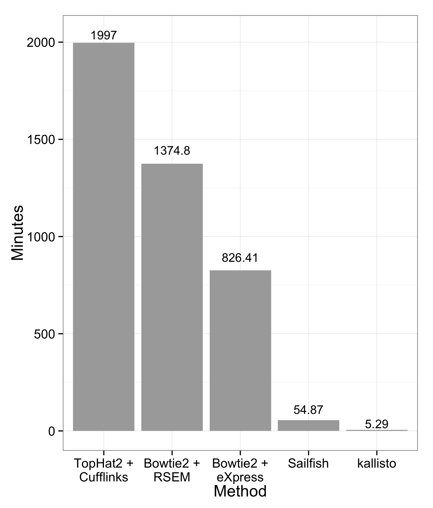
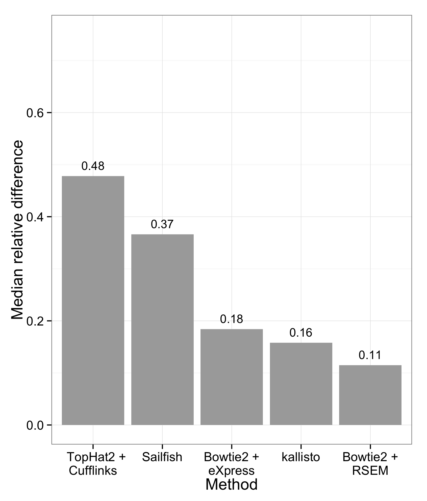



__kallisto__ is a program for quantifying abundances of transcripts from
RNA-Seq data, or more generally of target sequences using high-throughput
sequencing reads. It is based on the novel idea of _pseudoalignment_ for
rapidly determining the compatibility of reads with targets, without the need
for alignment. On benchmarks with standard RNA-Seq data, __kallisto__ can
    quantify 30 million human reads in less than 3  minutes on a Mac desktop
    computer using only the read sequences and a transcriptome index that
    itself takes less than 10 minutes to build. Pseudoalignment of reads
    preserves the key information needed for quantification, and __kallisto__
    is therefore not only fast, but also as accurate than existing
    quantification tools. In fact, because the pseudoalignment procedure is
    robust to errors in the reads, in many benchmarks __kallisto__
    significantly outperforms existing tools.

The figures above show the performance of __kallisto__ as compared to other programs. Running times are based on 20 cores used to quantify 20 samples each with 30 million reads. __kallisto__ is hundreds of times faster than standard tools (when disk access is not a limiting factor __kallisto__ is even faster, averaging about 2.5 minutes per run). Sailfish is much faster than most tools, although still significantly slower than __kallisto__, and its approach of shredding reads into k-mers reduces accuracy. This can be seen in the plot on the right which shows the median relative difference of quantifications with respect to the "truth" from simulations. Reads were simulated using the RSEM simulator.

The speed of __kallisto__ makes it tractable to use the bootstrap to determine
uncertainty on estimates. Uncertainty estimates can be used in downstream
applications and __kallisto__ includes infrastructure for managing the large
amount of data associated with bootstrapped samples. A companion tool to
__kallisto__, called __sleuth__ can be used to visualize and interpret
__kallisto__ quantifications, and soon to perform many popular differential
analyses in a way that accounts for uncertainty in estimates.

The __kallisto__ project was developed by [Nicolas
Bray](https://math.berkeley.edu/~nbray/), [Harold
Pimentel](http://www.cs.berkeley.edu/~pimentel/), [Páll
Melsted](https://notendur.hi.is/pmelsted/) and [Lior
Pachter](https://math.berkeley.edu/~lpachter/).

To use __kallisto__ [download the software](download.html) and visit the
[Getting started](starting.html) page for a quick tutorial.

