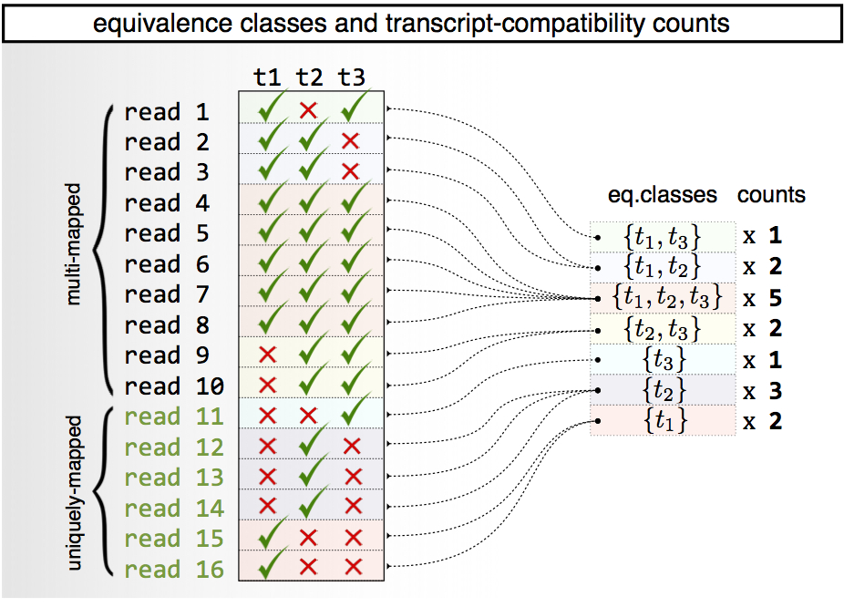

The analysis of single-cell RNA-Seq data involves a series of steps that include: (1) pre-processing of reads to associate them with their cells of origin, (2) possible collapsing of reads according to unique molecular identifiers (UMIs), (3) generation of feature counts from the reads to generate a feature-cell matrix and (4) analysis of the matrix to compare and contrast cells.

While __kallisto__ is not a solution to all of these requisite parts of a single-cell RNA-Seq analysis, it is useful for some of the steps. Specifically, in [previous work](http://genomebiology.biomedcentral.com/articles/10.1186/s13059-016-0970-8) we showed that single-cell RNA-Seq analysis starting with transcript compatibility counts (TCCs) has a number of advantages in comparison to standard "gene count" based analysis. 

__kallisto__ is well-suited to obtaining transcript compatibility counts from reads, and starting with version [0.43.0](https://pachterlab.github.io/kallisto//releases/2016/06/02/v0.43.0), __kallisto__ can take advantage of UMI information to deduplicate reads. It is therefore well useful as the basis of workflows for processing and analyzing single cell RNA-Seq data and we are developing a series of tools based on __kallisto__ for analysis of data from a variety of single-cell RNA-Seq technologies. 

Our first example is a complete workflow for the 10X Chromium single cell 3' digital expression technology:

- [Scripts and workflow description](https://github.com/lakigigar/scRNA-Seq-TCC-prep) for processing 10X Chromium single cell 3' digital expression data
- [Getting started](10xstarting.html) with analyzing 10X Chromium single cell 3' digital gene expression data
- [Our analysis](https://github.com/lakigigar/scRNA-Seq-TCC-prep/blob/master/pbmc3k/10xResults_pbmc3k.ipynb) of the 10X [pbmc3k](http://software.10xgenomics.com/single-cell/overview/datasets) Peripheral blood mononuclear cells (PBMCs) from a healthy donor data
- [Our analysis](https://github.com/lakigigar/scRNA-Seq-TCC-prep/blob/master/hgmm/10xResults_hgmm.ipynb) of the 10X [hgmm](http://software.10xgenomics.com/single-cell/overview/datasets) 1:1 mixture of fresh frozen human (HEK293T) and mouse (NIH3T3) cells data



